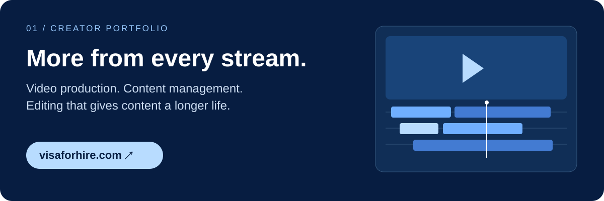

# Visa

I run a media company with **200M+ views** and work full time in **IT**. I build projects for everything in between, following my curiosity about coding and AI and sharing what I make along the way.

### Selected showcases

**Visa for Hire** — My creator portfolio: livestream content management, video production and editing, with the results behind the work.

[Visit the portfolio ↗](https://visaforhire.com/) · [Read the case study](showcases/visa-for-hire.md)

**Sijoituskästi: from podcast to owned media** — I pitched an article format built from their existing episodes. When news publishers already write stories about a podcast, the creators have an opportunity to publish their own coverage first and bring readers to their own site.

I designed and built a Finnish article prototype to demonstrate the idea: **more value from the same content, an owned written-media channel, and potential for additional ad revenue, SEO visibility and discovery through AI search.**

*Pitch and prototype; these are proposed benefits, not measured business results. The illustrations above introduce the projects rather than reproduce live screenshots.*

[View the article showcase ↗](https://visaforhire.com/sijoituskasti/) · [Read the pitch and case study](showcases/sijoituskasti.md)

### More projects

- 🐝 **[hive](https://github.com/visavv/hive)** — AI coding agents that work as a team and review each other's code.
- 📊 **[Claude Usage Band](https://github.com/visavv/claude-usage-band)** — Claude and Codex quota, always on screen in Claude Code.
- 🎬 **[Scouter](https://github.com/visavv/visamedia-showcase)** — Finds highlights in long livestreams and opens them in DaVinci Resolve.
- 🏠 **[Kiinteistöpito](https://github.com/visavv/kiinteistopito-showcase)** — A searchable maintenance logbook for your home, stored on your phone.
- ⏱️ **[Resolve Time Tracker](https://github.com/visavv/resolve-time-tracker)** — Time tracking and timesheets inside DaVinci Resolve.
- 📋 **[YouTube Transcript Copy](https://github.com/visavv/youtube-transcript-copy)** — Copy any YouTube transcript in one click, or send it to an AI for a summary.
